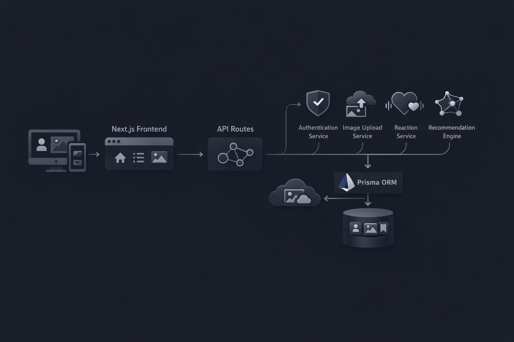

# Echoes

A non‑verbal, emotion‑driven visual platform where meaning is **felt**, not read.

Echoes explores how humans can communicate, discover, and personalize experiences **without using text**, relying only on images, colors, shapes, icons, and interaction.

---

## Youtube Link: 
In this video we explain how our platform works with voiceover and screen recording: 
https://youtu.be/PJ57UolkTbA?si=Unmqc367uxle6J2H

## HackDay Theme — Chosen Wonders

We intentionally selected the following Wonders because they naturally align with our goal of building a **silent emotional experience**.

---

### Wonder 1  
**“In a world made only of colors and sounds, how would emotions speak?”**

**Why we chose it**
- Emotions are often stronger than language.
- We wanted to explore communication that happens **before words**.

**How we represent it**
- Users enter the platform by selecting an emotion.
- Background colors and gradients animate based on emotion.
- Images are discovered and reacted to purely through visual cues.

---

### Wonder 4  
**“When hidden voices share meaning in the dark, what shape does their message take?”**

**Why we chose it**
- Meaning does not always need explanation.
- Silence can carry shared understanding.

**How we represent it**
- No captions, comments, or text explanations exist in the UI.
- Images communicate silently.
- Emotional reactions reveal meaning gradually, without being stated.

---

### Wonder 5  
**“Could a feeling hide inside a visual pattern, waiting for someone to understand it?”**

**Why we chose it**
- Visual patterns can hold emotional depth.
- Interpretation should be personal, not fixed.

**How we represent it**
- Images are tagged emotionally through user reactions.
- An image’s dominant emotion **emerges over time**, rather than being declared.
- Different users may feel different emotions from the same image.

---

### Wonder 10  
**“If the mind is never a slave, how far can it wonder — exploring, imagining, and discovering — while still holding on to what matters?”**

**Why we chose it**
- Exploration should be free, not guided by instructions or labels.
- Personal discovery is more powerful than forced understanding.

**How we represent it**
- No search terms or textual navigation.
- Discovery is emotion‑driven, not keyword‑driven.
- The system personalizes silently, without explanations like “recommended for you”.

---

## What We Are Building

This platform is a **visual emotion engine**, not a traditional social media platform.

Users can:
- Enter the experience through emotion
- Explore image‑based signals
- React non‑verbally
- Post images without captions
- Save or keep posts private
- Discover content based on emotional resonance

All without reading or writing words.

---

### Architecture Diagram

  

---

## System Architecture

The system follows a simple and efficient flow:

Client (Next.js UI)  
→ Server Actions / API Routes  
→ Prisma ORM  
→ Database  
→ Emotion Aggregation Logic  
→ Personalized Feed Response  

## User Experience Flow

1. Black landing screen with emotion icons  
2. Emotion selection triggers background animation  
3. Emotion‑based image feed appears  
4. Users explore and open images  
5. Images are reacted to using emotion icons  
6. Emotional meaning emerges through interaction  
7. Users can register and log in (icon‑only UI)  
8. Users post images or explore further  
9. Feed becomes personalized over time  

---

## Core Features

- Emotion‑based entry and discovery
- Image‑only posting system
- Non‑verbal reacting system
- Private (“Only Me”) posts
- Saved visual signals
- Silent personalization engine
- Icon‑only, text‑free UI

---

## Tech Stack

- **Next.js** (App Router)
- **Prisma**
- **MySQL**
- **Authentication (Credentials‑based)**
- **Cloud Image Storage**
- **GitHub Projects (Kanban)**

Example:
